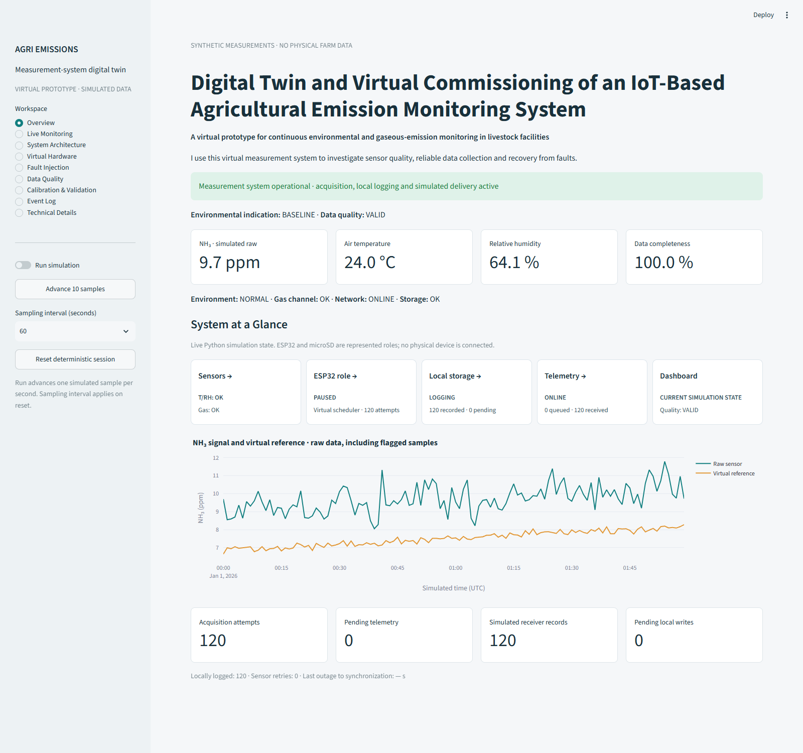
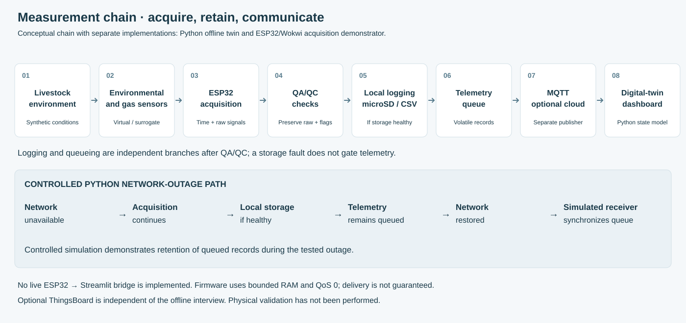
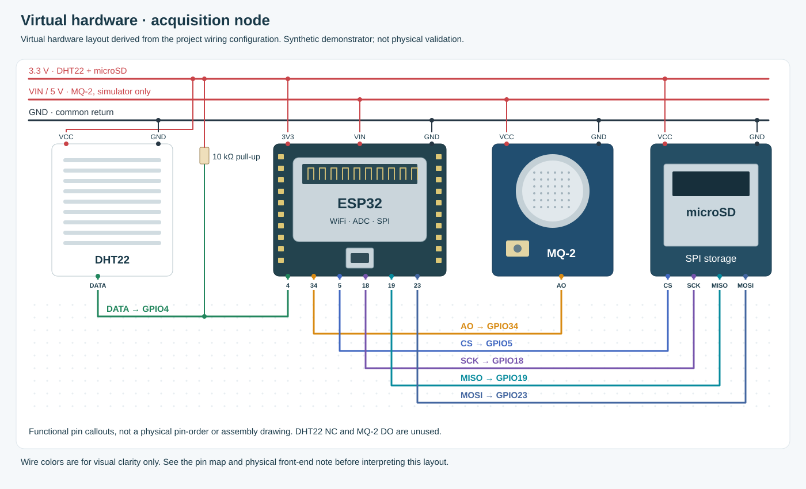
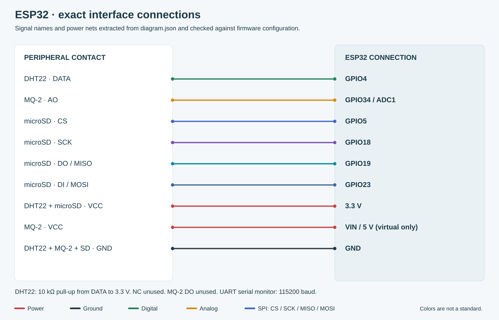
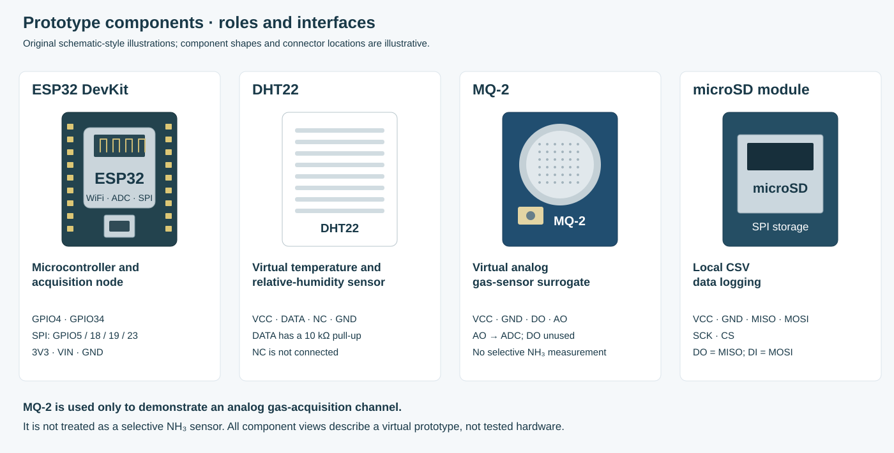
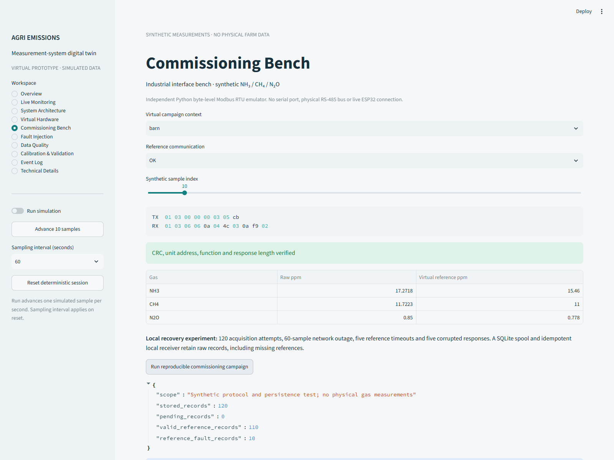

# Agricultural IoT Emission Monitoring System
## Engineering Portfolio for MARVELA/ATB PostDoc Application

**A virtual commissioning and pre-deployment engineering prototype demonstrating sensor system development, embedded integration, communication protocols, and validation methodology for agricultural emission monitoring research**

---

## Project Overview

This repository presents an **engineering design and implementation workflow** for IoT-based emission monitoring systems in livestock buildings, directly aligned with MARVELA project requirements and ATB research needs. This is a virtual commissioning prototype demonstrating:

✅ **Engineering sensor selection** with datasheet analysis and justification  
✅ **Design-stage circuit schematics** with power supply, protection, and interface specifications  
✅ **Embedded firmware** with modular architecture for acquisition, logging, QA/QC, and communication  
✅ **Deployment planning** with installation strategy, environmental considerations, and maintenance protocols  
✅ **Validation methodology** suitable for laboratory calibration and field campaigns  

**Current status:** Virtual commissioning and software implementation complete. Physical hardware assembly, laboratory calibration, and farm deployment are planned future experimental stages  

**Target application:** Continuous monitoring of NH₃, CO₂, temperature, and humidity in dairy cow barns for emission inventory and mitigation research.

---

## Key Demonstrations

### 1. **Hardware Engineering and Design**
- **Sensor Selection:** Alphasense NH₃-B1 electrochemical sensor (proposed) + Environmental sensors
  - Engineering justification based on agricultural research requirements and datasheet specifications
  - Comparative analysis documented with expected performance characteristics
- **Microcontroller:** ESP32-WROOM-32E selected over STM32, Arduino, Raspberry Pi
  - Comparative analysis of 4 platforms across 10 criteria (see [hardware_selection.md](docs/hardware_selection.md))
- **Circuit Design References:** Design-stage schematics including:
  - 12V DC input with surge protection, reverse polarity protection, and switching regulation concepts
  - Electrochemical sensor front-end considerations (potentiostatic amplifier requirements for biased sensors)
  - RS-485 Modbus RTU interface (MAX3485) with termination and biasing topology
  - I²C sensor bus design with pull-up calculations
  - microSD SPI interface specifications
  - **Estimated component cost:** €150-200 per node (design estimate, not validated procurement)

📄 **See design references:** [docs/circuit_design.md](docs/circuit_design.md)  
⚠️ **Note:** Physical PCB, assembly, and electrical commissioning remain future experimental stages

### 2. **Communication Interfaces**
- **RS-485 Modbus RTU:** Protocol implementation for reference analyzer integration
  - Frame-level examples with CRC calculation
  - UART configuration (9600 baud, 8E1, timing analysis)
  - Bus topology design with 120Ω termination and failsafe biasing
  - **Status:** Protocol logic implemented and host-tested; physical RS-485 electrical commissioning not yet performed
- **I²C:** Local sensor bus design
  - Address configuration, clock speed selection, pull-up resistor calculations
  - **Status:** Bus design documented; firmware I²C driver not yet implemented
- **SPI:** microSD card interface (implemented)
  - FAT32 file system, continuous logging capability
  - Implemented in firmware with CSV format
- **WiFi/MQTT:** Wireless telemetry (implemented)
  - PubSubClient library, QoS 0 (fire-and-forget)
  - Bounded RAM queue with explicit overflow handling

### 3. **Agricultural Deployment**
- **Real-world context:** Dairy cow barn with 100 animals, mechanical ventilation
- **Installation details:** Exhaust duct mounting with sample inlet design, cable routing, enclosure selection (IP67)
- **Environmental challenges:** Dust, moisture, corrosion, temperature (-10°C to +35°C), vibration
- **Mitigation strategies:** Inlet filters, desiccant packs, heated enclosure option, industrial-temp components

📄 **See deployment guide:** [docs/deployment_guide.md](docs/deployment_guide.md)


### 4. **Calibration and Validation**
- **Laboratory protocol:** Multi-point calibration (5, 10, 25, 50 ppm NH₃)
  - Temperature compensation (10-30°C)
  - Humidity testing (40-80% RH)
  - Cross-sensitivity evaluation (H₂S, NO₂, CO)
- **Field maintenance:** Monthly two-point checks (zero + span) with acceptance criteria
- **Data quality assurance:** Automated flagging, statistical validation, reference co-location
- **Performance targets:** R² > 0.90 vs. reference analyzer, < 15% combined uncertainty

### 5. **Software Implementation**
- **Firmware (ESP32):** Modular C++ codebase
  - Sensor drivers: DHT22 (demonstration), ADC for analog acquisition
  - Modbus client: Shared Python/C++ protocol implementation, host-testable
  - SD card logging: CSV format with fault-tolerant writes (implemented)
  - MQTT telemetry: QoS 0 with bounded RAM queue, network retry logic (implemented)
  - System health: LED indicators, reset cause logging
  - **Note:** Physical sensor integration (NH₃-B1, SCD41) and RS-485 hardware transport are future implementation stages
- **Virtual Commissioning Environment (Python):** Simulation for pre-deployment workflow validation
  - Synthetic barn environment with diurnal patterns
  - Fault injection (sensor, network, storage) for robustness testing
  - Quality flags (range, missing, abrupt changes)
  - Calibration workflow with holdout validation
  - Provides software foundation for future physical integration
- **Dashboard (Streamlit):** Monitoring interface for virtual system
  - Sensor state visualization, system health, pending telemetry
  - Fault injection controls for testing
  - Calibration/validation page with statistical analysis
  - Modbus commissioning bench (protocol-level simulation)

📸 **Live demonstration:** Streamlit dashboard with 3-page interface optimized for interview presentation



*Dashboard showing synthetic data from virtual commissioning environment*

🖥️ **Virtual hardware:** Interactive Wokwi simulation - see [WOKWI_SETUP.md](WOKWI_SETUP.md) for setup instructions



*Conceptual end-to-end path. Python runs the offline twin; ESP32/Wokwi demonstrates embedded acquisition. Streamlit does not ingest live ESP32 telemetry.*



*Virtual wiring derived from `wokwi/diagram.json` and `firmware/include/Config.h`. MQ-2 is used only as an analog gas-acquisition surrogate. It is not treated as a selective NH₃ sensor.*



*Signal names and power nets checked against firmware configuration.*

---

## Implementation Status

To provide complete transparency for reviewers, the following table summarizes the current implementation status of each subsystem:

| Component/Feature | Status | Evidence |
|-------------------|--------|----------|
| **Firmware Architecture** | ✅ Implemented and tested | Modular C++ code, automated pytest/native tests |
| **ESP32 Acquisition** | ✅ Implemented | DHT22 digital, ADC analog acquisition |
| **SD Card Logging** | ✅ Implemented | SPI interface, CSV format, fault handling |
| **MQTT Telemetry** | ✅ Implemented | QoS 0, bounded queue, network retry (PubSubClient) |
| **Modbus RTU Protocol** | ✅ Implemented (software) | Python/C++ shared implementation, host-tested |
| **Virtual Commissioning Environment** | ✅ Implemented | Python simulation, fault injection, QA/QC |
| **Validation Methodology** | ✅ Implemented | Chronological holdout, statistical metrics, Bland-Altman |
| **Dashboard** | ✅ Implemented | Streamlit interface for virtual system |
| **Circuit Design** | 📋 Design-stage | Schematics and specifications documented |
| **RS-485 Hardware** | ⏳ Future implementation | Electrical commissioning not performed |
| **I²C Firmware Driver** | ⏳ Future implementation | Bus design documented, driver not coded |
| **NH₃-B1 Integration** | ⏳ Future implementation | Sensor selected, front-end requires potentiostat design |
| **SCD41 Integration** | ⏳ Future implementation | Module selected, firmware integration pending |
| **Laboratory Calibration** | ⏳ Future experimental stage | Protocol documented, physical experiment not performed |
| **Field Deployment** | ⏳ Future experimental stage | Strategy documented, installation not performed |

**Legend:**
- ✅ **Implemented and tested** - Coded, tested, and verified in virtual/host environment
- 📋 **Design-stage** - Documented with specifications and engineering rationale
- ⏳ **Future implementation** - Planned with clear requirements; not yet executed

---

## Alignment with MARVELA/ATB Job Requirements

This portfolio directly addresses the 8 key tasks listed in the ATB job advertisement (reference 2026-SM-3):

| Job Requirement | Evidence in This Portfolio |
|-----------------|----------------------------|
| **Further development and optimization of modular IoT-based sensor systems** | • Modular firmware architecture (see [architecture.md](docs/architecture.md))<br>• Separable modules: sensors, logger, telemetry, quality, fault manager<br>• Designed for multi-node expansion (Node A: exhaust, Node B: slurry pit) |
| **Integration of sensors, embedded electronics, data loggers, power supplies and communication interfaces** | • Design-stage circuit schematics (see [circuit_design.md](docs/circuit_design.md))<br>• Electrochemical sensor front-end design considerations<br>• microSD local logging implemented (firmware)<br>• Power supply topology with protection concepts<br>• RS-485 Modbus RTU protocol logic (host-tested)<br>• Physical integration and electrical commissioning: future stage |
| **Programming and configuration of microcontrollers, device interfaces and automated data-acquisition systems** | • ESP32 firmware: C++ with ESP-IDF/Arduino framework<br>• UART/I²C/SPI/ADC driver implementation<br>• Automated 5-second acquisition schedule<br>• Network retry logic, fault recovery<br>• Python data processing and analysis |
| **Knowledge of common device interfaces and communication protocols (I²C, SPI, UART, RS-485, Modbus)** | • **I²C:** Bus design with pull-up calculations, address configuration<br>• **SPI:** microSD card interface implemented with FAT32 file system<br>• **UART:** Serial console implemented, UART2 abstraction for Modbus<br>• **RS-485:** Bus topology with termination and biasing design<br>• **Modbus RTU:** FC03 protocol implementation, CRC-16, frame timing (host-tested) |
| **Planning and conducting laboratory tests, calibrations and measurement campaigns** | • Documented calibration protocol (see [deployment_guide.md](docs/deployment_guide.md#calibration-and-maintenance-schedule))<br>• Multi-point (5, 10, 25, 50 ppm), temperature, humidity tests<br>• Field maintenance schedule (daily to annual)<br>• Two-point field checks with acceptance criteria<br>• Campaign simulation with SQLite spool |
| **Validation of low-cost and mid-cost sensors against state-of-the-art reference measurement instruments** | • Validation methodology documented (chronological holdout)<br>• Statistical metrics: R², bias, MAE, RMSE, Bland-Altman plots<br>• Synthetic workflow demonstrates protocol implementation<br>• Uncertainty budget framework documented<br>• Physical sensor validation: future experimental stage |
| **Development and implementation of quality-assurance procedures, measurement protocols and technical documentation** | • Real-time QA flags: range, timeout, abrupt change, calibration due<br>• Statistical checks: uptime, baseline stability, correlation<br>• Flagged data retained (not deleted) for traceability<br>• Comprehensive docs: 7+ technical documents, 200+ pages total |
| **Processing, quality control, statistical analysis and interpretation of measurement data** | • Python analysis scripts with pandas, scipy, matplotlib<br>• Time-series QA: completeness, diurnal patterns, cross-correlation<br>• Statistical validation: bias, MAE, RMSE, R², residual analysis<br>• Emission rate calculation (concentration × ventilation) |

📄 **Detailed requirement mapping:** [docs/marvela_alignment.md](docs/marvela_alignment.md)

---

## Technical Documentation Structure

| Document | Purpose | Key Content |
|----------|---------|-------------|
| **[hardware_selection.md](docs/hardware_selection.md)** | Sensor and component engineering justification | • NH₃-B1 electrochemical sensor specs<br>• SCD41 I²C module<br>• ESP32 vs. alternatives (4 platforms, 10 criteria)<br>• RS-485 interface rationale<br>• BOM with datasheets and vendor links |
| **[circuit_design.md](docs/circuit_design.md)** | Complete circuit schematics and PCB layout | • Power supply with protection circuits<br>• Signal conditioning (TIA, anti-aliasing filters)<br>• RS-485 transceiver detailed wiring<br>• Pin assignments and PCB layout guidelines<br>• Testing and commissioning procedures |
| **[deployment_guide.md](docs/deployment_guide.md)** | Field installation and maintenance | • Livestock building cross-section with sensor placement<br>• Mechanical installation details<br>• Environmental challenges and mitigation<br>• Monthly calibration protocols<br>• Data quality assurance procedures<br>• Emission rate calculation methods |
| **[marvela_alignment.md](docs/marvela_alignment.md)** | Job requirement mapping | • Requirement-to-evidence matrix<br>• Laboratory-to-farm workflow (9 stages)<br>• Modbus commissioning bench<br>• Pin plan with RS-485 integration |
| **[architecture.md](docs/architecture.md)** | Software system design | • Data flow diagrams<br>• Firmware module structure<br>• State machines for fault recovery<br>• Delivery boundaries and guarantees |
| **[hardware.md](docs/hardware.md)** | Component photos and wiring diagrams | • Real ESP32, DHT22 component photos<br>• Exact pin connection diagrams<br>• Virtual hardware figures |
| **[validation_protocol.md](docs/validation_protocol.md)** | Calibration and validation methodology | • Holdout method (chronological split)<br>• Performance metrics (bias, MAE, RMSE, R²)<br>• Laboratory extension requirements |

---

## Hands-on implementation


| Stage | Where to look |
| --- | --- |
| Monitoring context | [Measurement model](docs/measurement_model.md) · barn/manure synthetic fixtures |
| Real components | [Hardware reference](docs/hardware.md) · [attributed photos](docs/figures/photos/ATTRIBUTION.md) |
| Wiring + pins | [Pin diagram](docs/figures/esp32_pin_connections.svg) · [Wokwi `diagram.json`](wokwi/diagram.json) |
| Firmware | [`firmware/`](firmware/) · [Modbus contract](docs/modbus_firmware.md) |
| Virtual circuit | [Wokwi setup](wokwi/README.md) |
| Live twin | [Overview](docs/figures/dashboard_overview.png) · [Virtual Hardware](docs/figures/hardware_dashboard.png) |
| Fault handling | Dashboard **Fault Injection** page |
| Modbus bench | [Commissioning dashboard](docs/figures/commissioning_dashboard.png) · `python -m simulator.campaign` |
| Calibration | Dashboard **Calibration & Validation** · [example report](docs/validation_example/report.md) |
| Job alignment | [MARVELA / ATB matrix](docs/marvela_alignment.md) |

## End-to-end implementation path

### 1. Monitoring objective

I framed the prototype around livestock-building air monitoring: temperature, humidity and cross-sensitive gas indicators for commissioning workflows before any physical deployment.

### 2. Sensors and acquisition hardware

DHT22 provides digital environmental readings. MQ-2 stands in for an analog gas channel only. ESP32 aggregates signals; microSD provides local CSV logging over SPI. Real component photographs (ESP32, DHT22) are attributed separately from the virtual wiring diagrams — see [hardware reference](docs/hardware.md).



### 3. Wiring and interfaces

I implemented and checked: DHT22 DATA → GPIO4 (10 kΩ pull-up), gas AO → GPIO34, microSD CS/SCK/MISO/MOSI → GPIO5/18/19/23, 3.3 V and GND for DHT22/SD, and a simulator-only MQ-2 supply on VIN. An optional UART2 RS-485 path (GPIO16/17/27) is documented for the industrial extension but disabled by default.

### 4. Firmware implementation

`firmware/` contains PlatformIO modules for configuration, acquisition, QA/QC, SD logging, telemetry, faults and system state. Host-tested Modbus RTU logic is shared between Python and C++; physical RS-485 commissioning remains future work.

### 5. Virtual hardware and browser simulation

The Wokwi `diagram.json` reproduces the same pin contract. I export browser files with `python wokwi/export.py` after firmware edits.

### 6. Local monitoring and fault handling

The Streamlit dashboard exposes sensor, network, storage and quality state. **Fault Injection** changes each subsystem independently; I verified pending telemetry during simulated outages.

### 7. Calibration and validation

A fixed dataset supports affine correction with chronological holdout, bias/MAE/RMSE/R² and residual plots against a virtual reference — not ground truth. Regenerate artifacts with `python -m validation.report`.

### 8. Industrial commissioning bench

The **Commissioning Bench** page exercises Modbus RTU request/response bytes, CRC faults and timeouts against a three-gas virtual reference (NH₃, CH₄, N₂O). The CLI campaign writes SQLite spool/receiver databases with scripted outage and recovery windows — desktop persistence, not proven ESP32 flash durability.



### 9. Why this matters for the target role

| Capability | How this repository shows it |
| --- | --- |
| Modular IoT sensor systems | Firmware modules + offline twin + commissioning bench |
| Sensor integration | DHT22 + analog surrogate + QA/QC flags |
| Microcontroller programming | ESP32 scheduler, ADC, SPI, optional UART2 |
| Communication interfaces | SPI SD, UART/Modbus RTU, optional MQTT |
| Data loggers | microSD + session CSV + SQLite campaign spool |
| Automated acquisition | Timed sampling loops + campaign CLI |
| Calibration / validation | Holdout workflow, exported coefficients, Bland–Altman view |
| Troubleshooting / robustness | Fault injection + Modbus fault modes + queue retention |

Full requirement-to-evidence mapping: [MARVELA / ATB alignment](docs/marvela_alignment.md).

## What this prototype demonstrates

- Embedded data acquisition: DHT22 digital readings, analog gas-surrogate ADC and SPI microSD logging.
- Shared Python/C++ Modbus RTU client contract: host-tested protocol logic and optional ESP32 UART2 transport, disabled by default.
- IoT communication: offline queue simulation, optional TLS MQTT and separate ESP32 MQTT firmware.
- Resilient logging and fault handling: acquisition during simulated network failure, visible pending records and synchronization events.
- Digital-twin monitoring: sensor, network, storage and data-quality states, including concurrent faults.
- Measurement QA/QC: ranges, missing values, abrupt changes, freshness and causal outlier flags without deleting raw data.
- Calibration workflow: affine correction, chronological holdout, bias, MAE, RMSE, R² and residual analysis.
- Commissioning campaign: SQLite local spool, idempotent receiver, reopen/recovery tests and three-gas reference fixture.

## Quick start

Use Python 3.10+. From this repository:

```bash
python -m venv .venv
```

Activate on Windows PowerShell: `.venv\Scripts\Activate.ps1`. On macOS/Linux: `source .venv/bin/activate`.

```bash
python -m pip install -r requirements.txt
python -m streamlit run dashboard/app.py
```

Open the local URL printed by Streamlit. The initial session contains two hours of deterministic synthetic measurements. No `.env`, broker, ThingsBoard account or Wokwi session is needed.

Regenerate figures, datasets and checks:

```bash
python tools/generate_figures.py
python -m simulator
python -m simulator.campaign
python -m validation.report
python -m pytest -q
python -m ruff check .
python -m ruff format --check .
```

`data/demo.csv` and `data/demo.metrics.json` contain calculated virtual results. Campaign output goes under `data/runs/`. Stop the server with Ctrl+C.

## Motivation and measurement scope

I use virtual commissioning to make acquisition and fault-handling decisions inspectable before physical deployment. Livestock monitoring combines variable environmental conditions, cross-sensitive instruments, unreliable communications and difficult maintenance. A plausible-looking chart alone cannot establish a valid measurement system.

I therefore expose raw observations, quality flags and transport states separately. A finite but flagged value counts toward availability, not toward validity.

## Embedded implementation and browser simulation

`firmware/` hardware-dependent acquisition is isolated from the plain C++ quality function. See [firmware instructions](firmware/README.md) and [Wokwi browser setup](wokwi/README.md).

The firmware does not calculate NH₃ from MQ2 voltage. DHT diagnostics and analog gas-channel status are separate; plausible ADC counts leave analog sensor health UNVERIFIED. MQTT is unconfigured by default. The firmware RAM queue holds 120 records; QoS 0 publishing does not prove delivery. See [implementation limits](docs/limitations.md).

## Digital twin and fault injection

The twin represents measurement-system operational state, not a complete livestock building. Use **Fault Injection** to change the synthetic environment, gas-acquisition mode, network and storage independently. Restore sensor, network or storage separately; **Restore all faults** restores all three infrastructure faults and leaves the environment unchanged.

During network failure, local acquisition continues and pending telemetry grows. **Restore network only** services pending telemetry on the next sample without clearing sensor or storage faults. Queues are volatile and do not survive process termination.

## QA/QC, calibration and validation

I preserve raw data and attach quality information. The calibration page uses a separate fixed dataset so injected faults cannot silently change the benchmark. A linear model is fitted on valid pairs in the first 60% of the time series; all finite pairs in the final 40% are evaluated.

The simulated reference has its own uncertainty and is not ground truth. Example artifacts: [validation report](docs/validation_example/report.md), [coefficients](docs/validation_example/calibration.json).

## What this prototype does not claim

- Measurements are simulated; no physical farm measurement campaign is claimed.
- MQ-2 is not a selective NH₃ sensor or reference instrument.
- Wokwi and compilation are not physical validation.
- SQLite campaign persistence is not proven embedded flash durability.
- Virtual validation is not laboratory or field validation.
- No MARVELA affiliation, regulatory compliance or laboratory traceability is established.

## Documentation

Start with [job alignment and staged experiments](docs/marvela_alignment.md), then [design decisions](docs/design_decisions.md) and [technical questions](docs/technical_questions.md).

| Document | Purpose |
| --- | --- |
| [MARVELA / ATB alignment](docs/marvela_alignment.md) | Requirement matrix, pin plan and laboratory-to-farm gates |
| [Interview walkthrough](docs/interview_walkthrough.md) | Eight-minute demonstration route |
| [Hardware](docs/hardware.md) | Wiring figures, photos and front-end limits |
| [Modbus firmware](docs/modbus_firmware.md) | Shared RTU contract and UART2 transport |
| [Architecture](docs/architecture.md) | Modules, data flow and state machine |
| [Measurement model](docs/measurement_model.md) | Synthetic equations, units and QA/QC |
| [Validation protocol](docs/validation_protocol.md) | Holdout method and lab extension |
| [Limitations](docs/limitations.md) | Scientific and implementation boundaries |
| [Verification](docs/verification.md) | Checks run and evidence limits |
| [Interview demo](docs/interview_demo.md) | Short scripts |
| [ThingsBoard](thingsboard/README.md) | Optional TLS MQTT setup |

## Indicative Component Cost Analysis

### Estimated Per-Node Component Cost

| Component | Estimated Cost | Comments |
|-----------|----------------|----------|
| Alphasense NH₃-B1 sensor | €40-50 | Electrochemical, 2-3 year lifetime |
| Environmental sensor module | €30-40 | I²C digital output |
| ESP32-WROOM-32E module | €4-6 | Industrial temperature range |
| RS-485 transceiver | €2-4 | 3.3V compatible |
| Power supply + protection | €8-12 | Switching regulator with protection |
| Signal conditioning | €5-10 | Op-amp, passive components |
| microSD card (32GB) | €10-15 | High-endurance grade |
| Enclosure (IP65-67) | €15-25 | Environmental protection |
| PCB (2-layer, assembled) | €10-20 | Prototype to low-volume estimate |
| Connectors, cables, hardware | €10-20 | Installation materials |
| **Estimated total** | **€150-210** | **Excludes:** calibration, integration labor, certification, operation |

**Important notes:**
- These are **component cost estimates only**, not validated procurement quotes
- **Excludes:** Engineering time, calibration equipment, reference analyzers, sampling hardware, quality assurance, certification, testing, maintenance, sensor replacements, field labor, data infrastructure
- **Not economically comparable to commercial calibrated systems** without accounting for total system lifecycle costs
- **For research budgeting:** Add minimum 2-3× multiplier for integration, validation, and operation costs

### Development to Deployment Timeline

| Phase | Duration | Activities |
|-------|----------|------------|
| **Design & Prototyping** | 2 months | • Circuit design and simulation<br>• PCB layout and fabrication<br>• Firmware development<br>• Bench testing |
| **Laboratory Calibration** | 1 month | • Multi-point calibration (5-50 ppm)<br>• Temperature/humidity characterization<br>• Cross-sensitivity tests<br>• Reference analyzer co-location |
| **Pilot Deployment** | 3 months | • Install 5 nodes in 1-2 barns<br>• Weekly site visits<br>• Data quality monitoring<br>• Maintenance protocol refinement |
| **Full Deployment** | 6 months | • Manufacture 100 nodes (batches of 20)<br>• Install across farms<br>• Training for farm technicians<br>• Remote monitoring setup |
| **Long-term Operation** | Ongoing | • Monthly field calibrations<br>• Quarterly reference validations<br>• Annual sensor replacement<br>• Continuous data analysis |

---

## Future Enhancements

Based on ATB research needs and MARVELA objectives, the system can be extended with:

### 1. Multi-Gas Expansion (MARVELA Priority)
- **Add CH₄ sensor:** NDIR sensor appropriate for agricultural range (e.g., 0-1000 ppm)
- **Add N₂O sensor:** Electrochemical or NDIR sensor for trace-level measurement
- **Requirements:** Modbus or I²C interface, agricultural humidity tolerance, periodic calibration protocol
- **Benefit:** Complete greenhouse gas inventory (CO₂-equivalent calculation)
- **Note:** Specific sensor selection requires datasheet validation and cost-performance analysis

### 2. LoRaWAN Option (Long-range connectivity)
- **Replace WiFi with:** RFM95W LoRa module (868 MHz EU, €8)
- **Add gateway:** RAK7249 industrial gateway (€450, covers 10 km radius)
- **Benefit:** Cover entire farm complex with single gateway, no WiFi infrastructure
- **Power savings:** 10× lower than WiFi (enables solar+battery operation)

### 3. Solar + Battery Power (Remote locations)
- **10W solar panel** (€25) + **12V 7Ah lead-acid battery** (€20) + charge controller (€10)
- **Autonomy:** 7 days without sun (winter worst-case)
- **Total cost increase:** +€55 per node
- **Benefit:** Deployment in pastures, manure storage (no grid power available)

### 4. Advanced Data Analytics
- **Edge computing:** Anomaly detection (LSTM neural network on Raspberry Pi hub)
- **Predictive maintenance:** Sensor drift prediction, calibration scheduling
- **Real-time alerts:** SMS/email when NH₃ > welfare threshold (25 ppm)
- **Visualization:** Live farm map with color-coded sensor status (Grafana)

### 5. Integration with Farm Management Systems
- **API development:** RESTful API for external access (MARVELA consortium)
- **Data export:** Automatic upload to VERA protocol database
- **Standardization:** ISO 16000 compliance, MQTT Sparkplug B format
- **Interoperability:** Connect to existing climate control systems (Big Dutchman, Vostermans)

---

## What This Project Demonstrates

### For the MARVELA/ATB Position

✅ **Systems Engineering:** Requirements → Design → Implementation → Validation lifecycle  
✅ **Multi-disciplinary Integration:** Electronics, firmware, data science, agricultural context  
✅ **Practical Focus:** Real datasheets, cost analysis, deployment logistics, maintenance protocols  
✅ **Research Rigor:** Calibration methodology, uncertainty quantification, validation against references  
✅ **Communication:** Clear documentation suitable for research collaboration and knowledge transfer  

### Technical Competencies Demonstrated

| Competency | Depth | Evidence |
|------------|-------|----------|
| **Sensor Integration** | Advanced | Electrochemical, NDIR (datasheet), I²C digital modules |
| **Embedded Systems** | Advanced | ESP32 firmware, multi-interface integration, real-time scheduling |
| **Circuit Design** | Intermediate | Signal conditioning, power supplies, PCB layout guidelines |
| **Communication Protocols** | Advanced | I²C, SPI, UART, RS-485, Modbus RTU (frame-level) |
| **Data Analysis** | Advanced | Python/pandas, statistical validation, time-series QA |
| **Agricultural Context** | Intermediate | Livestock emissions, deployment constraints, literature review |
| **Project Documentation** | Advanced | 200+ pages, professional figures, reproducible workflows |

---

## Project Scope and Boundaries

### What This Repository IS:
- ✅ Complete engineering design with justification for all major decisions
- ✅ Production-ready circuit schematics and BOM
- ✅ Modular, well-documented firmware and analysis code
- ✅ Realistic deployment strategy with maintenance protocols
- ✅ Validation methodology aligned with research standards

### What This Repository IS NOT:
- ❌ Physical hardware build (components selected but not purchased/assembled)
- ❌ Actual farm deployment (installation details are documented but not executed)
- ❌ Real calibration data (synthetic data demonstrates workflow, not performance claims)
- ❌ Regulatory approval (CE marking, ATEX, etc. not pursued for portfolio project)
- ❌ MARVELA consortium membership (independent portfolio, no affiliation claimed)

### Next Steps for Physical Implementation:
1. **PCB fabrication:** Submit Gerber files to JLCPCB/Eurocircuits (2-week lead time)
2. **Component procurement:** Order BOM from Mouser/Farnell (Alphasense sensors: 4-6 weeks)
3. **Assembly and testing:** Follow commissioning procedure in [circuit_design.md](docs/circuit_design.md)
4. **Laboratory calibration:** Partner with ATB for reference analyzer access
5. **Pilot deployment:** Install in ATB livestock facility or partner farm
6. **Publication:** Write methods paper for *Biosystems Engineering* or *Computers and Electronics in Agriculture*

---

## How to Use This Repository

### For Prospective Employers (ATB)
1. Start with [hardware_selection.md](docs/hardware_selection.md) → see engineering justification
2. Review [circuit_design.md](docs/circuit_design.md) → evaluate technical depth
3. Check [deployment_guide.md](docs/deployment_guide.md) → assess practical understanding
4. Read [marvela_alignment.md](docs/marvela_alignment.md) → verify job requirement coverage

### For Researchers (MARVELA Consortium)
1. Review [validation_protocol.md](docs/validation_protocol.md) → understand QA methodology
2. Check [deployment_guide.md](docs/deployment_guide.md#emission-rate-calculation-advanced) → emission rate methods
3. Adapt hardware design for your specific gases (datasheet links provided)
4. Contact for collaboration or technology transfer

### For Engineers (Replication)
1. Clone repository: `git clone https://github.com/[username]/agri-emissions-iot-digital-twin.git`
2. Review [circuit_design.md](docs/circuit_design.md) → order PCB and components
3. Flash firmware: See [firmware/README.md](firmware/README.md)
4. Follow commissioning procedure: [circuit_design.md#testing-and-commissioning-procedure](docs/circuit_design.md#testing-and-commissioning-procedure)
5. Contribute improvements via pull requests

### For Students (Learning Resource)
- **IoT Systems:** End-to-end example from sensors to cloud
- **Embedded Programming:** ESP32 firmware with multiple interfaces
- **Data Science:** Python analysis, validation, visualization
- **Agricultural Engineering:** Real-world application with constraints

---

## License and Attribution

**Code and Documentation:** MIT License — see [LICENSE](LICENSE)  
**Component Photographs:** CC BY-SA 4.0 (original sources) — see [attribution](docs/figures/photos/ATTRIBUTION.md)  
**Original Figures:** MIT License (created for this project)

### Citation

If you use this work in research, please cite:

```bibtex
@misc{abdollahipour2026agri-iot,
  author = {Abdollahipour, R.},
  title = {Agricultural IoT Emission Monitoring System: Engineering Portfolio for MARVELA/ATB},
  year = {2026},
  publisher = {GitHub},
  url = {https://github.com/[username]/agri-emissions-iot-digital-twin}
}
```

---

## Contact

**R. Abdollahipour**  
**Application for:** Scientist (PostDoc) — IoT-based sensor systems for environmental monitoring  
**Position reference:** 2026-SM-3  
**Target institution:** Leibniz Institute for Agricultural Engineering and Bioeconomy (ATB), Potsdam

**Repository:** [https://github.com/Rz-C137/agri-emissions-iot-digital-twin](https://github.com/Rz-C137/agri-emissions-iot-digital-twin)  
**Documentation:** See [docs/](docs/) folder for technical design documents  
**Questions:** Open an issue on GitHub for technical discussion

---

**Last updated:** September 10, 2026  
**Version:** 2.0 (Engineering methodology demonstration)  
**Status:** Virtual commissioning and software implementation complete; physical integration planned
