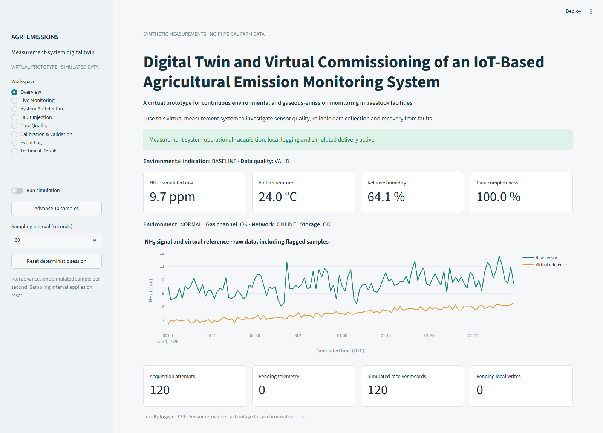
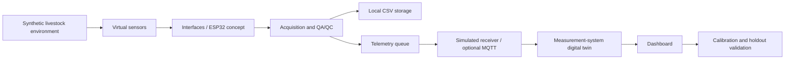

# Digital Twin and Virtual Commissioning of an IoT-Based Agricultural Emission Monitoring System

**A virtual prototype for continuous environmental and gaseous-emission monitoring in livestock facilities**

I designed this portfolio prototype to investigate the complete measurement chain: acquisition, sensor interfaces, quality assurance, logging, communication, calibration and fault recovery. The primary demonstration runs locally without hardware, accounts or cloud services.

**All measurements are synthetic.** This is an independent personal project; no employer or research-project affiliation is implied. Gas concentration is demonstrated, not an emission mass rate.

## Interface preview



The opening screen separates environmental conditions from monitoring-system health. Dedicated pages expose acquisition, fault handling, data quality and virtual validation.

## Architecture overview



Python implements the complete offline virtual chain. The modular ESP32/Wokwi project is a separate embedded acquisition demonstration. Live firmware ingestion into Streamlit is not implemented. The MQ2 analog chain is deliberately separate from the Python synthetic NH₃ instrument model.

## What this prototype demonstrates

- Embedded data acquisition and sensor interfacing: DHT22 digital readings, analog gas-surrogate ADC readings and SPI microSD logging.
- IoT communication: offline queue simulation, optional TLS MQTT publishing and separate ESP32 MQTT firmware.
- Resilient logging and fault handling: local acquisition during simulated network failure, visible pending records, synchronization and retry events.
- Digital-twin state monitoring: sensor, network, storage and data-quality states, including concurrent infrastructure faults.
- Measurement QA/QC: ranges, missing/nonfinite values, abrupt changes, freshness and causal outlier flags without deleting raw measurements.
- Calibration and reference-method validation workflow: transparent affine correction, chronological holdout, bias, MAE, RMSE, R², completeness and residual analysis against a virtual reference.

## Quick start

Use Python 3.10 or newer. From this repository directory:

```bash
python -m venv .venv
```

Activate on Windows PowerShell with `.venv\Scripts\Activate.ps1`, or on macOS/Linux with `source .venv/bin/activate`. If activation is restricted, use `.venv\Scripts\python.exe` instead of `python`.

```bash
python -m pip install -r requirements.txt
python -m streamlit run dashboard/app.py
```

Open the local URL printed by Streamlit. The initial session contains two hours of deterministic synthetic measurements. No `.env`, broker, ThingsBoard account or Wokwi session is needed. Installation requires internet access once; the core dashboard subsequently works offline.

To generate the reproducible three-day dataset and calculated metrics:

```bash
python -m simulator
python -m pytest -q
python -m ruff check .
python -m ruff format --check .
```

`data/demo.csv` and `data/demo.metrics.json` contain calculated virtual results. A dashboard session writes to a unique ignored file under `data/runs/`. Resetting starts a new session and retains the old CSV. Stop the server with Ctrl+C.

## Motivation and measurement scope

I use virtual commissioning to make acquisition and fault-handling decisions inspectable before physical deployment. Livestock monitoring combines variable environmental conditions, cross-sensitive instruments, unreliable communications and difficult maintenance. A plausible-looking chart alone cannot establish a valid measurement system.

I therefore expose raw observations, quality flags and transport states separately. A finite but flagged value counts toward availability, not toward validity. Overview separates environmental indication, operational health, sensor state, network, storage and data quality: elevated synthetic NH₃ does not by itself mean broken acquisition. The illustrative high-NH₃ threshold is a demonstration setting, not a regulatory or occupational limit.

## Embedded implementation and browser simulation

`firmware/` contains PlatformIO modules for configuration, records, acquisition, QA/QC, SD logging, telemetry, fault events and system state. Hardware-dependent acquisition is isolated from the plain C++ quality function. See [firmware instructions](firmware/README.md) and [free Wokwi browser setup](wokwi/README.md).

The firmware does not calculate NH₃ from MQ2 voltage. Its NH₃ fields remain empty/null. DHT diagnostics and analog gas-channel status are separate; plausible ADC counts leave analog sensor health UNVERIFIED. Python and firmware share numeric quality codes and readable flags; see the [schema contract](docs/schema.md). MQTT is unconfigured by default. The firmware RAM queue holds 120 records; overflows are reported, and available SD records remain accessible. Its QoS 0 publishing does not prove delivery. See the explicit [implementation limits](docs/limitations.md).

## Digital twin and fault injection

The twin represents measurement-system operational state, not a complete livestock building. Use **Fault Injection** to change the synthetic environment, gas-acquisition mode, network and storage independently. Restore sensor, network or storage separately; **Restore all faults** explicitly restores all three and leaves the environment unchanged. Every control acquires a sample immediately and every transition is logged.

During network failure, local acquisition continues and pending telemetry grows. **Restore network only** services pending telemetry on the next sample and records synchronization without clearing sensor or storage faults. The Python receiver acknowledges in process; this is a controlled no-gap demonstration within a running session. During combined network and storage failures, both pending queues remain visible. They are volatile and do not survive process termination.

## QA/QC, calibration and validation

I preserve raw data and attach quality information. The quality page includes counts, flags, event history and CSV export. The calibration page uses a separate fixed dataset, so injected interview faults cannot silently change the benchmark. A linear model is fitted on valid pairs in the first 60% of the time series; all finite pairs in the final 40% are evaluated. Missing pairs remain in the completeness denominator.

Plots show the time series, raw/calibrated scatter with a 1:1 line, residuals, and errors versus time, temperature and humidity. The current demonstration is simple affine sensor-to-reference calibration. Temperature- and humidity-compensated calibration is a possible future extension, not a fitted model here. The baseline does not eliminate environmental cross-sensitivity or drift. The simulated reference also has error and is not ground truth.

## What this prototype does not claim

- Measurements are simulated; no physical farm measurement campaign is claimed.
- MQ2 is not treated as a selective NH₃ sensor or reference instrument.
- The project does not model complete barn physics, airflow, animal physiology or manure processes.
- Virtual validation is not a substitute for laboratory or field validation.
- No certified procedure, regulatory compliance, laboratory traceability or physical hardware performance is established.

## Documentation and interview route

| Document | Purpose |
| --- | --- |
| [Architecture](docs/architecture.md) | Responsibilities, firmware modules, data flow and state machine |
| [Measurement model](docs/measurement_model.md) | Synthetic equations, units, schema and QA/QC |
| [Validation protocol](docs/validation_protocol.md) | Virtual holdout method and proposed laboratory extension |
| [Limitations](docs/limitations.md) | Scientific and implementation boundaries |
| [Interview demonstration](docs/interview_demo.md) | Five-minute and 90-second scripts |
| [ThingsBoard guide](thingsboard/README.md) | Optional TLS MQTT setup and field mapping |
| [Verification](docs/verification.md) | Checks actually run and remaining external checks |

## Future physical implementation

I would select an NH₃-appropriate instrument and reference method, characterize cross-sensitivity and drift in controlled conditions, validate signal conditioning and power protection, and then evaluate ingress protection, contamination, condensation, cleaning, maintainability and placement. A durable acknowledged outbox, clock synchronization audits, independent validation and ventilation measurements would precede any emission-rate interpretation. See the proposed protocol for the separation between planned work and demonstrated virtual behavior.

## License

MIT; see [LICENSE](LICENSE). Dependencies retain their own licenses. The core uses free open-source software. Optional services are unnecessary for the local interview; do not activate a paid plan to run it.
