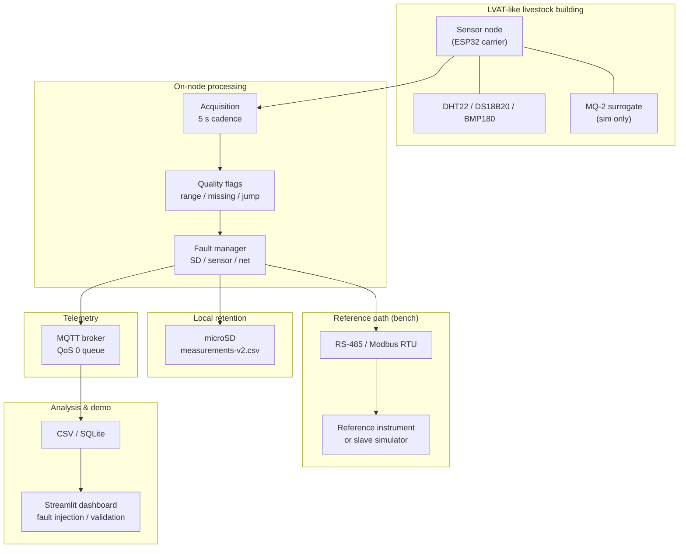

# Data Ecosystem — Barn to Dashboard

End-to-end view of the **bench-to-barn demonstrator**: acquisition, storage, communication, QA/QC, and fault handling.

## System diagram

## Layer responsibilities

| Layer | Technology | Demonstrates |
|-------|------------|--------------|
| Sensors | DHT22, DS18B20, BMP180, MQ-2; bench: SCD41 | Multi-interface integration |
| MCU | ESP32 (Arduino / PlatformIO) | Embedded programming |
| Local log | SPI + FAT / SD library | Data logger |
| Field bus | UART + MAX485 + Modbus | RS-485, device interfaces |
| Wireless | WiFi + PubSubClient | IoT telemetry |
| QA/QC | `Quality.h`, dashboard flags | Measurement protocols |
| Twin | Python simulation | Pre-deployment validation |

## Fault detection surfaces

| Fault class | Firmware / twin | Dashboard |
|-------------|-----------------|-----------|
| Sensor invalid / NaN | `environmental_sensor_ok` | Red sensor status |
| SD failure | `storage_ok`, retry in `main.cpp` | Storage fault inject |
| MQTT loss | Queue overflow counter | Network fault inject |
| Modbus timeout/CRC | `Rs485Transport`, `# MODBUS_REFERENCE` serial | Modbus bench page |
| Time unsynced | `UNSYNCHRONIZED` in CSV | Timestamp column |

## Storage formats

- **On SD:** `measurements-v2.csv` (see [schema.md](schema.md))
- **Twin / dashboard:** synthetic CSV under `data/`
- **Future campaign:** dated folders under `data/campaigns/` (not populated until real run)

## Interview walkthrough (2 minutes)

1. Open [farm_context.md](farm_context.md) — *where and why*  
2. Open Wokwi / `diagram.json` — *exact pins*  
3. Flash firmware — *drivers and serial CSV*  
4. Streamlit — *live QA and fault injection*  
5. `physical_prototype/photos/` — *hands-on evidence* (when available)

## Related

- [demonstrator_blueprint.md](demonstrator_blueprint.md)
- [architecture.md](architecture.md)
- [interview_walkthrough.md](interview_walkthrough.md)
