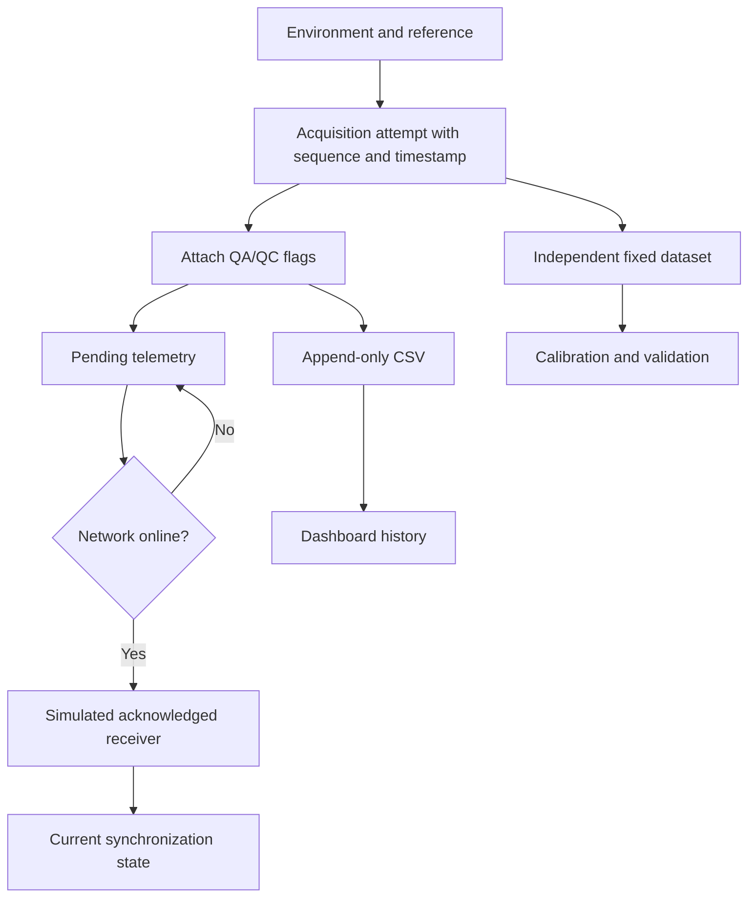
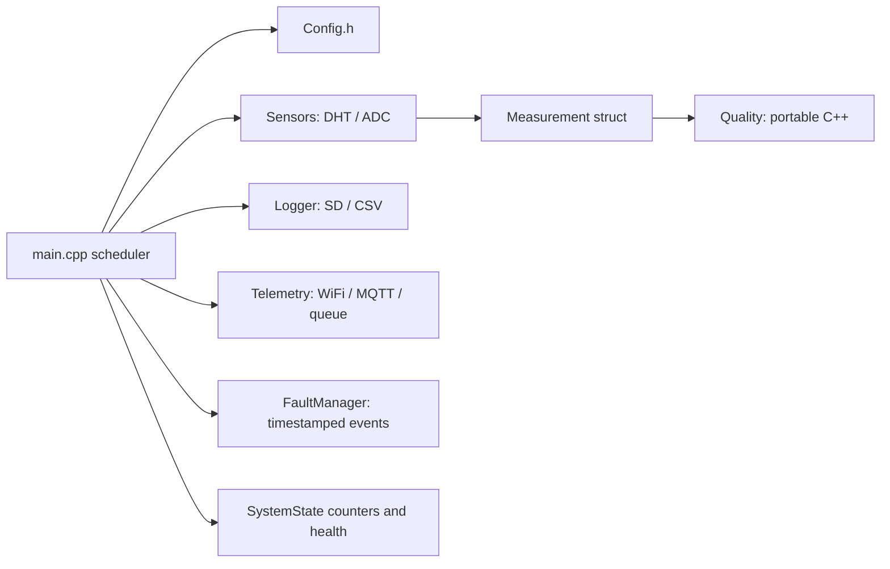
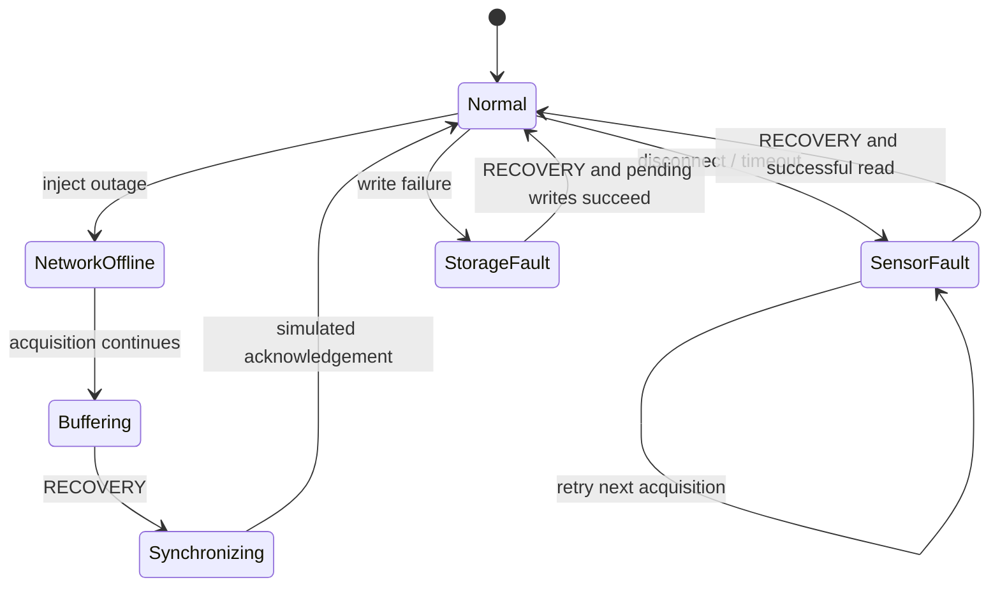

# System architecture

I separate measurements from the mechanisms that transport and interpret them. Python and ESP32 are complementary demonstrations; the browser simulator is not a dependency of the local twin.

| Subsystem | Responsibility | Implementation |
| --- | --- | --- |
| Environment | Diurnal covariates and synthetic gas changes | `simulator/model.py` |
| Instrument | Bias, noise, drift and environmental dependence | `Environment.sample` |
| Acquisition/twin | Scheduled attempts, fault injection, operational state | `simulator/engine.py` |
| Quality | Preserve observations and return explicit flags | `simulator/quality.py` |
| Local log | Append acquisition records to a session CSV | `Twin._persist` |
| Simulated transport | Sequence-keyed pending and acknowledged records | `Twin.pending`, `Twin.delivered` |
| Calibration | Fit earlier samples; assess later samples | `validation/analysis.py` |
| Interface | Eight progressive-disclosure pages | `dashboard/app.py` |
| External transport | TLS MQTT with QoS 1 checkpoint | `thingsboard/publish.py` |

## Data flow

Records contain the state **at acquisition**. `buffered` remains true after synchronization if a record was acquired offline; it is provenance, not the current queue status. Current synchronization comes from the pending and delivered collections. CSV rows are not rewritten after delivery. Local storage recovery appends retained records, so CSV physical row order can differ from sequence order; sort by timestamp/sequence for analysis.

The Python simulation uses one node per session. Node identifiers and named fields permit extension to more nodes and variables; use a compound run/node/sequence identifier before aggregating multiple sessions. CH₄, pressure and ventilation would require explicit units, instrument models and new quality rules.

## Firmware modules

The five-second acquisition interval respects the slow DHT22 interface. A failed sensor read is retried on the next acquisition. Network connection attempts occur every ten seconds with a bounded MQTT socket timeout; this cooperative loop is not hard real-time. Storage remounts are retried every ten seconds. The status LED indicates sensor and storage health; MQTT state is reported separately.

## Fault recovery

The diagram summarizes transitions; network and storage faults are independent and can coexist. Choosing NORMAL clears a sensor/high-concentration scenario but does not reconnect infrastructure. RECOVERY requests healthy infrastructure and restores the normal sensor model. Physical disconnection and recovery are not inferred by this Python engine.

## Delivery boundaries

Python queues never evict records silently, but memory consumption grows with session length. No process-restart replay is implemented. Firmware queues are bounded and explicitly count rejected records. ESP32 QoS 0 return values mean publish accepted by the client, not durable broker receipt. The optional Python publisher waits for QoS 1 acknowledgement and checkpoints progress, with possible duplicates after a crash between acknowledgement and checkpoint. None of these layers claims exactly-once end-to-end delivery.
