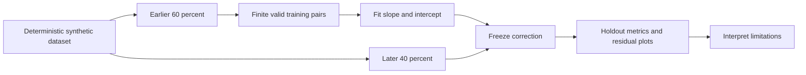

# Virtual validation and proposed physical extension

## Implemented virtual workflow

I generate 4,320 one-minute samples with the default seed. The first 60% forms the calibration block. Only finite training pairs with VALID quality enter ordinary least squares: `reference = slope × raw + intercept`. The final 40% is never used to estimate coefficients. It is evaluated on every finite pair, including flagged observations, so anomalous holdout values are not silently removed to improve results.

For `error = sensor − reference`, bias is mean error, MAE is mean absolute error and RMSE is the square root of mean squared error. R² is `1 − sum(error²)/sum((reference − mean(reference))²)` and is undefined for a constant reference or insufficient data. It can be negative. Completeness divides finite pairs by all scheduled rows; missing percentage is its complement. No unsupported values are substituted for undefined metrics.

The calibration page plots time-series comparison, reference/sensor scatter, 1:1 agreement, residuals versus reference, time, temperature and humidity, and compares raw/calibrated metrics. Residual covariate structure is evidence that a single linear correction may be insufficient, not an invitation to tune against the holdout. The reference has its own simulated uncertainty. Sharing a synthetic latent model makes this test much easier than real validation.

Network recovery time is elapsed simulated seconds from outage injection until the first post-recovery synchronization cycle. It includes outage duration; it is not a measured radio reconnection latency or gas sensor response time. The local receiver drains instantly in model time. Sensor retries occur once per scheduled sample.

## Proposed laboratory workflow — not performed

I would first specify the intended concentration range, reporting interval, environmental operating range, response requirements and permissible uncertainty with the application team. I would choose an NH₃-suitable sensor and reference method, establish the reference's calibration history, uncertainty and traceability, and document sampling-line materials, adsorption, condensation and residence-time effects.

I would expose instruments to controlled concentration levels across the intended range and environmental covariates, using repeated exposures, independent replicates and blank checks. Concentration order would be randomized or counterbalanced where practical. Repeatability would be distinguished from between-day and between-unit reproducibility. Temperature, humidity, flow and stabilization time would be recorded alongside instrument data.

I would separate calibration runs from independent validation days, devices or batches before fitting any correction. I would freeze the model and preprocessing before inspecting holdout performance. Reference and test readings would be time-aligned using documented clock and sample-line delays. Any exclusion would retain the original record and a reason.

Validation would assess signed bias, precision, MAE/RMSE, concentration-dependent residuals, environmental dependence, missing data, saturation, drift and repeatability. Step exposures would support a response-time assessment with a predefined criterion (for example, a stated fraction of the final change), accounting for reference and plumbing delay. Repeat checks over days would assess drift and define recalibration intervals.

I would test sensor disconnects, power interruptions, exhausted storage and network outages with a known acquisition count. Acceptance criteria would be set before testing and would include record accounting, timestamp quality and recovery time. Durable replay and deduplication would be verified across resets rather than inferred from an in-memory simulation.

Only after laboratory evaluation would I propose field trials with placement, maintenance and environmental metadata. Ventilation and representative concentration sampling would be required before calculating emission mass flux. No certified procedure or successful laboratory/field result is claimed here.
